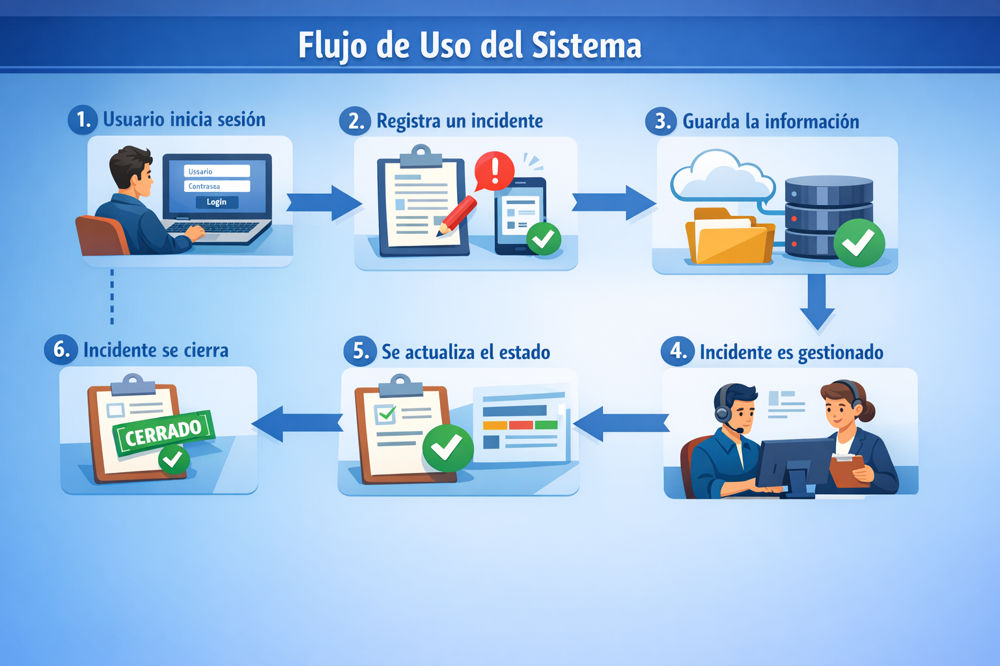

# Arquitectura del Sistema

## Descripción

El sistema sigue una arquitectura de tres capas:

Frontend → Backend → Base de datos

---

## Diagrama

---

## Flujo

1. Usuario interactúa con frontend
2. Backend procesa la solicitud
3. Base de datos almacena información

---

## Beneficios

- Escalable
- Centralizado
- Fácil mantenimiento