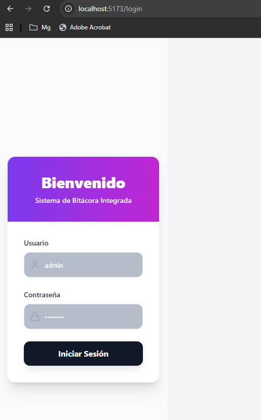
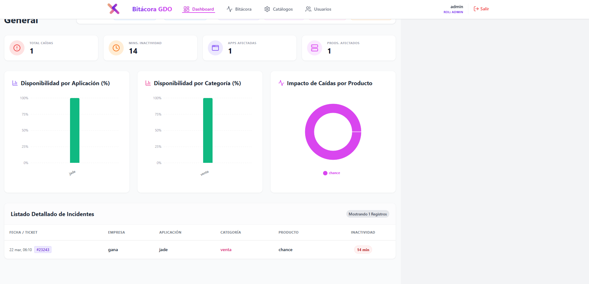
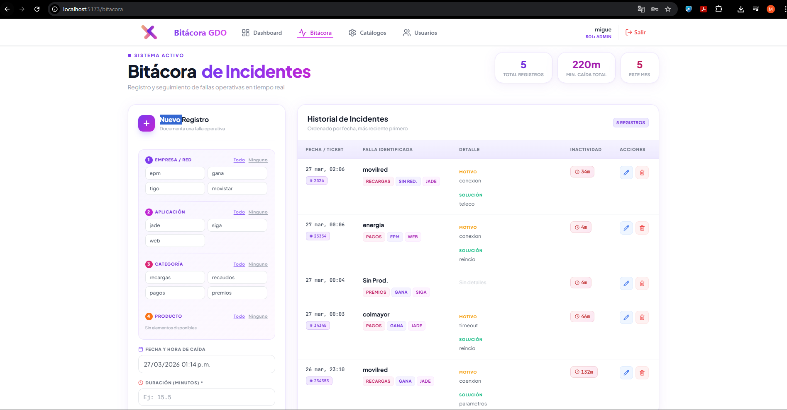
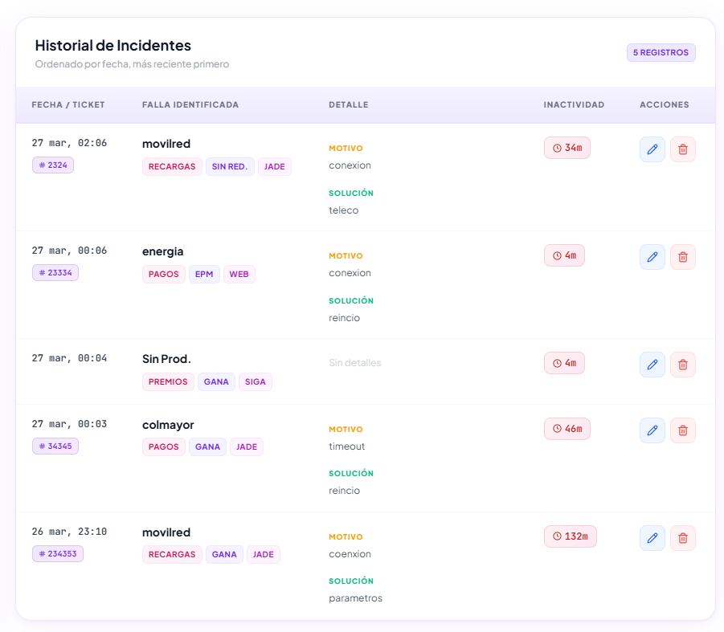

# Manual de Usuario

## 1. Introducción
Sistema para gestionar indisponibilidades en entornos TI.

---

## 2. Acceso al sistema

El usuario ingresa sus credenciales:

---

## 3. Panel principal

Vista general del sistema:

---

## 4. Registro de incidentes

Formulario para crear un incidente:

Pasos:
1. Ingresar descripción
2. Seleccionar prioridad
3. Guardar

---

## 5. Gestión de incidentes

Listado de incidentes registrados:

Permite:
- editar
- cerrar
- consultar

---

## 6. Reportes

El sistema permite visualizar datos históricos y métricas.