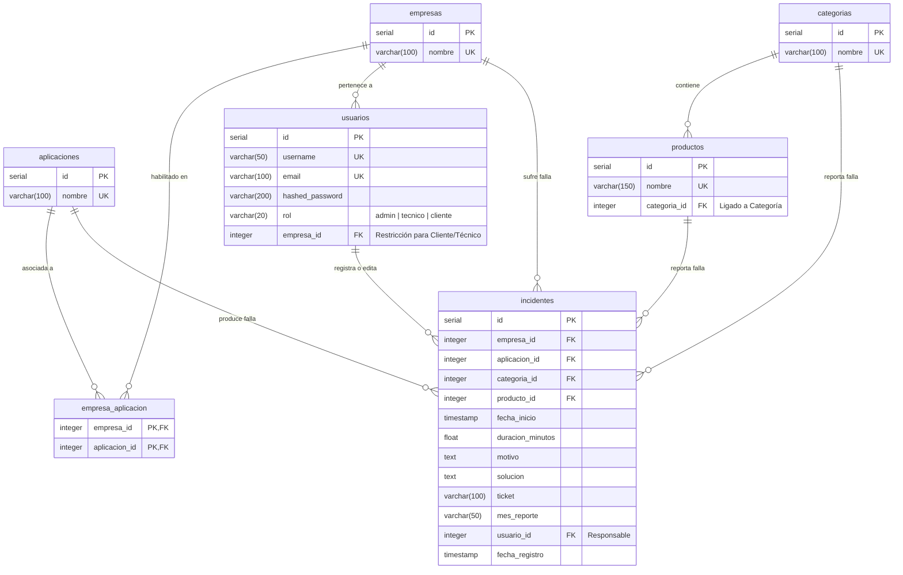

# Diagrama Entidad-Relación (Mermaid JS)

Copia todo el bloque de código de abajo y pégalo en [Mermaid Live Editor](https://mermaid.live) para ver tu diagrama al instante y poder exportarlo como imagen PNG o archivo vectorial SVG.

